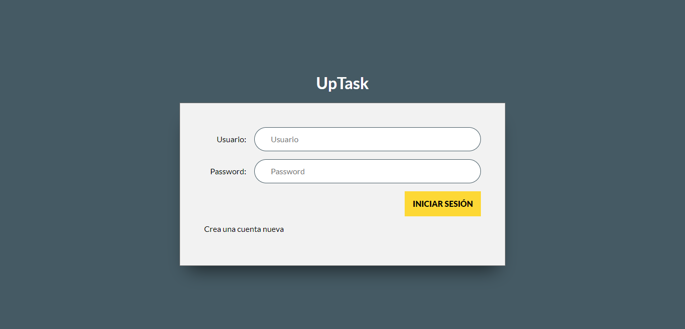
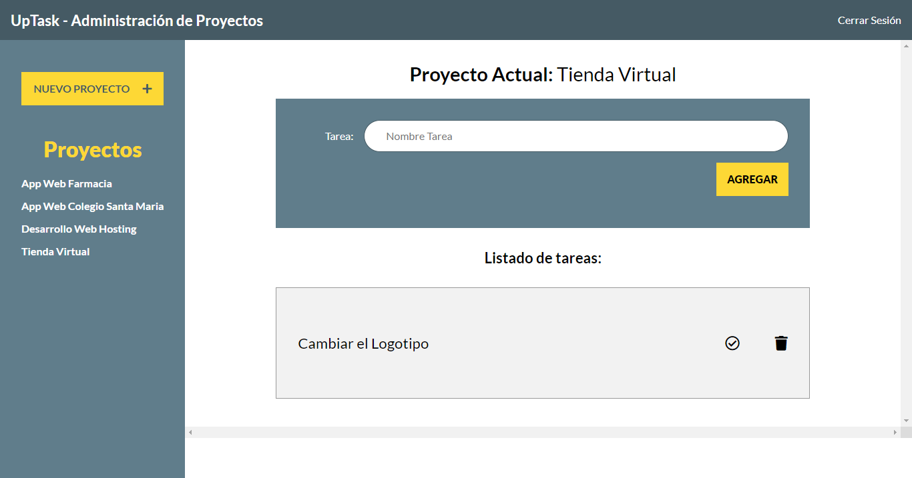

# CRUD-Project-Manager
> ## Project developed in the Frontend HTML5, CSS3, JavaScript, AJAX and the plugin js <a href="https://sweetalert2.github.io/">sweetalert2<a> for alerts and in the Backend PHP and MySql.

# Login
## A login was created for administrators with hashed passwords.

# Administration panel
## The administration panel is in development. So far you can only create new projects and soon you can add tasks to these projects.

